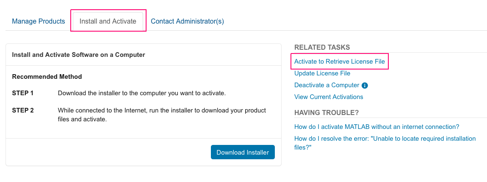
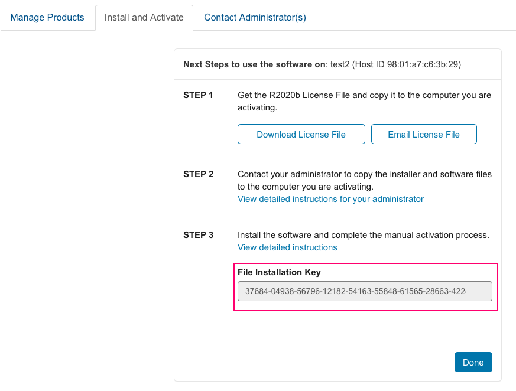

# Create a MATLAB Container Image

## Requirements

You must perform these steps on a Linux platform. Before starting, you must install the following on the client platform

Docker
Git

# Introduction

The following steps guide you through the process of creating a Docker container image that contains a Linux environment with a MATLAB installation. Use the container image as a scalable and reproducible method to deploy MATLAB in a variety of situations including clouds and clusters.

##  Step 1. Clone this Repository

1. Clone this repository to your Linux client using

git clone https://github.com/mathworks-ref-arch/matlab-dockerfile.git

1. Inside the cloned repository, create a subdirectory named matlab-install

## Get MATLAB ISO

To obtain the installation files, you must be an administrator for the license linked with your MathWorks account.
1. Log in to your [UCL MathWorks account](https://www.mathworks.com/login), via the mathworks link at the UCl software library.
1. Download the Installer for Linux of the desired MATLAB version.
2. Follow the steps at [Download Products Without Installation](https://www.mathworks.com/help/install/ug/download-only.html).
3. Specify the location of the `matlab-install` subdirectory of the cloned repository as the path to the download folder.
4. Select the installation files for the Linux (64-bit) version of MATLAB.
5. Select the products you want to install in the container image.
6. Confirm your selections and complete the download.

## Step 3. Obtain the License File and File Installation Key
1. Click on your user profile in the upper right corner and select *My Account*. Select the Install and Activate tab. Select the link *Activate to Retrieve License File*.




3. Click *Activate a Computer*
4. Fill put the fields, with the computers MAC adreess as *Host ID* and press continue.
5. On the following page, answer the question *Is the software installed* with *No* and press *continue*.
6. Copyt the text from the *File Installation Key* and download the license file.
7. Copy *license.lic* file to the `matlab-install` folder.



## Step 4. Define Installation Parameters
1. Make a copy of the file `installer_input.txt` in the `matlab-install` folder. Move the copy up one directory level, into the root directory of the cloned repository.
2. Rename the file to `matlab_installer_input.txt`.
3. Open `matlab_installer_input.txt` in a text editor and edit the following sections:
    - `fileInstallationKey` Paste your File Installation Key and uncomment the line.
    - `agreeToLicense` Set the value to yes and uncomment the line.
    - Specify products to install. Uncomment the line `product.MATLAB` to install MATLAB. Uncomment the corresponding line for each additional product you want to install. If you are not licensed to use a product, uncommenting the line does not install the product in the container. Your File installation Key identifies the products you can install.
4. In the Dockerfile, uncomment the line `ADD network.lic /usr/local/MATLAB/licenses/` and change `network.lic` to `license.lic`.

## Step 5. Build Image
Use the `docker build` command to build the image, using ```.``` to specify this folder. Run the command from the root directory of the cloned repository. Use a command of the form:
```
docker build -t matlab:r2020a


## Step 6. Run Container
Use the `docker run` command to run the container. Use a command of the form:
```
run -it --rm --net=host --name=matlabc matlab:r2020b

```
- `-it` option runs the container interactively.
- `--rm` option automatically removes the container on exit.
- `--net` use the host network device for the container. (The Host ID / MAC address will be the hosts one, so the MATLAB license in the container linked to this MAC address will work.)